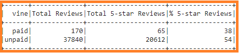

# Amazon_Vine_Analysis
New project on analyzing Amazon reviews written by members of the paid Amazon Vine program.

## Project Overview
Using knowledge of `PySpark, Pandas, SQL to analyzing Amazon reviews written by members of the paid Amazon Vine program. The Amazon Vine program is a service that allows manufacturers and publishers to receive reviews for their products. Companies like SellBy pay a small fee to Amazon and provide products to Amazon Vine members, who are then required to publish a review In this project the 'Pet Care' dataset will be reviewed. PySpark will be used to perform the ETL process to extract the dataset, transform the data, connect to an AWS RDS instance and load the transformed data into pgAdmin. Afterwards, the PySpark,Pandas or SQL to determine if there is any bias towards favourable reviews from Vine members in the dataset. Ergo, this assignment consists of three (3) technical deliverables. They are:

- Deliverable 1: Perform ETL on Amazon Product Reviews
- Deliverable 2: Determine Bias of Vine Reviews
- Deliverable 3: A Written Report on the Analysis (README.md)

## Purpose
The purpose of this project is to analyze Amazon reviews written by members of the paid Amazon Vine program

## Resources
- **Data Source:** `Amazon_Review_ETL`, `Challenge_schema`, `Vine_Review_Analysis`
- **Software:** `PySpark`, `Pandas`, `SQL`, `GitHub`

## Amazon_Vine_Analysis Results
>
>**Image showing the Vine Summary Dataframe:**
>
>
>
>**How many Vine reviews and non-Vine reviews were there?**
> There are `170` **Vine** reviews whereas there are `37,840` **non-Vine** Reviews.
>
>
>**How many Vine reviews were 5 stars? How many non-Vine reviews were 5 stars?**
> There are `65` **Vine** reviews whereas there are `20,612` **non-Vine** Reviews.
>
>
>**What percentage of Vine reviews were 5 stars? What percentage of non-Vine reviews were 5 stars?**
> There are `38%` **Vine** reviews whereas there are `54%` **non-Vine** Reviews.
>
## Summary
> No positivity bias was observed for reviews in the Vine program. The percentage of non-Vine 5 stars reviews was 16% higher than the Vine 5 stars reviews.
>
> Additional analysis that could be performed with the dataset are:
>
>- Calculate the total number of reviews, 
>- Calculate the number of reviews per stars, 
>- Calculate the percentage (%) of reviews per stars for all Vines (Vine and non vine reviews),
>- Calculate the total vine reviews for all ratings
